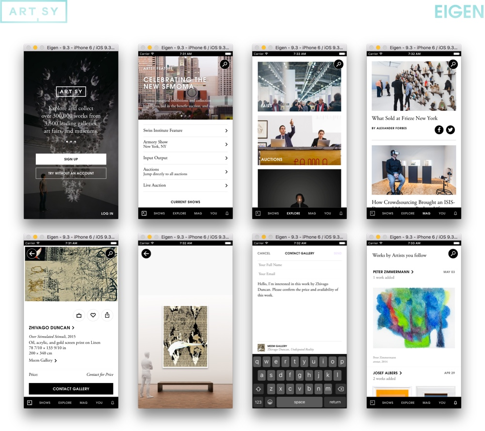

<a href="http://iphone.artsy.net"></a>

### Meta

* __State:__ production
* __Point People:__ [@alloy](https://github.com/alloy), [@orta](https://github.com/orta)
* __CI :__  [](https://circleci.com/gh/artsy/eigen)

This is a core [Artsy Mobile](https://github.com/artsy/mobile) OSS project, along with [Energy](https://github.com/artsy/energy), [Eidolon](https://github.com/artsy/eidolon), [Emission](https://github.com/artsy/emission) and [Emergence](https://github.com/artsy/emergence).

Don't know what Artsy is? Check out [this overview](https://github.com/artsy/meta/blob/master/meta/what_is_artsy.md) and [more](https://github.com/artsy/meta/blob/master/README.md), or read our objc.io on [team culture](https://www.objc.io/issues/22-scale/artsy).

Want to know more about Eigen? Read the [mobile](http://artsy.github.io/blog/categories/mobile/) blog posts, or [eigen's](http://artsy.github.io/blog/categories/eigen/) specifically.

### Docs

Get setup [here](docs/getting_started.md). Further documentation can be found in the [documentation folder](docs#readme).

### Work at Artsy?

Instead of `make oss` below, run `make artsy` to set up [spacecommander](https://github.com/square/spacecommander) and [SwiftLint](https://github.com/realm/SwiftLint). 

Then you'll want to find "Eigen" in our Engineering 1Password for your ENV vars, CocoaPods Keys should ask during the `pod install`.

### Quick Start

Want to get the app running? Run this in your shell:

```sh
git clone https://github.com/artsy/eigen.git
cd eigen
gem install bundler
bundle install --without development distribution

make oss # or make artsy

bundle exec pod install --repo-update
open Artsy.xcworkspace
```

This will set you up on our staging server, you will have a running version of the Artsy app by hitting `Build > Run`.

**Note**: `bundle exec pod install` may fail the first time you run it (due to a [bug](https://github.com/orta/cocoapods-keys/issues/127) in a dependency of ours). Re-running the command should work.

### Deployment

For how we deploy, check out the dedicated documentation:

- [Deploying a beta](docs/deploy_to_beta.md)
- [Deploying to the App Store](docs/deploy_to_app_store.md)

### Thanks

Thanks to all [our contributors](/docs/thanks.md).

## License

MIT License. See [LICENSE](LICENSE).
