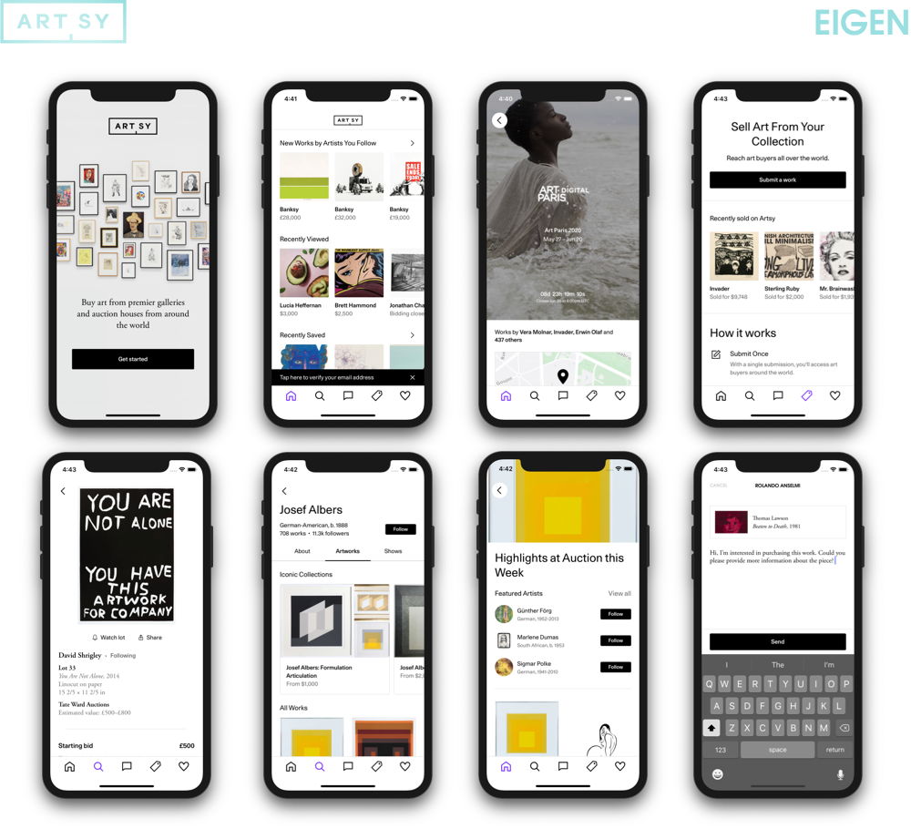

### Meta

- **State:** Production
- **[Point People][point_people]:** [Brian Beckerle][brian_github_profile], [Mounir Dhahri][mounir_github_profile], [George Kartalis][george_github_profile]
- **CI:** [][circle_ci]

### Intro

Don't know what Artsy is?
Check out [this overview][overview] or read our objc.io on [team culture][team_culture].

[Artsy][artsy_github] is an Open Source project. Feel free to check the [Artsy readme][artsy_readme] for an overview as well as [Practices][artsy_practices] and [Playbooks][artsy_playbooks].

Eigen is Artsy's mobile app repository.

Want to know more about Eigen? Read the [mobile][artsy_blog_mobile_posts] blog posts, or [eigen's][artsy_blog_eigen_posts] specifically.

Other mobile projects are [Energy][energy], with the retired [Eidolon][eidolon], [Emission][emission] and [Emergence][emergence].

### Getting Started

- Get set up [here][getting_started].

- Read about our [best practices][best_practices].

- Further documentation can be found in the [documentation folder][docs_readme].

### Deployment

For how we deploy, check out the dedicated documentation:

- [Deploying a beta][deploying_a_beta]
- [Deploying to the App Store][deploying_to_the_app_store]

### Thanks

Thanks to all [our contributors][thanks].

## License

MIT License. See [LICENSE](LICENSE).

## About Artsy

This project is the work of engineers at [Artsy][footer_website], the world's
leading and largest online art marketplace and platform for discovering art.
One of our core [Engineering Principles][footer_principles] is being [Open
Source by Default][footer_open] which means we strive to share as many details
of our work as possible.

You can learn more about this work from [our blog][footer_blog] and by following
[@ArtsyOpenSource][footer_twitter] or explore our public data by checking out
[our API][footer_api]. If you're interested in a career at Artsy, read through
our [job postings][footer_jobs]!

[footer_website]: https://www.artsy.net/
[footer_principles]: https://github.com/artsy/README/blob/main/culture/engineering-principles.md
[footer_open]: https://github.com/artsy/README/blob/main/culture/engineering-principles.md#open-source-by-default
[footer_blog]: https://artsy.github.io/
[footer_twitter]: https://twitter.com/ArtsyOpenSource
[footer_api]: https://developers.artsy.net/
[footer_jobs]: https://www.artsy.net/jobs
[point_people]: https://www.notion.so/artsy/17c4b550458a4cb8bcbf1b68060d63e6?v=3604e2682d024b64bde705abb2facebd
[brian_github_profile]: https://github.com/brainbicycle
[mounir_github_profile]: https://github.com/MounirDhahri
[george_github_profile]: https://github.com/gkartalis
[circle_ci]: https://circleci.com/gh/artsy/eigen
[overview]: https://github.com/artsy/README/blob/main/culture/what-is-artsy.md#artsy-in-a-nutshell
[team_culture]: https://www.objc.io/issues/22-scale/artsy
[artsy_github]: https://github.com/artsy
[artsy_readme]: https://github.com/artsy/README
[artsy_practices]: https://github.com/artsy/README/tree/main/practices
[artsy_playbooks]: https://github.com/artsy/README/tree/main/playbooks
[artsy_blog_mobile_posts]: http://artsy.github.io/blog/categories/mobile/
[artsy_blog_eigen_posts]: http://artsy.github.io/blog/categories/eigen/
[energy]: https://github.com/artsy/energy
[eidolon]: https://github.com/artsy/eidolon
[emergence]: https://github.com/artsy/emergence
[emission]: https://github.com/artsy/emission
[getting_started]: docs/getting_started.md
[best_practices]: docs/best_practices.md
[docs_readme]: docs#readme
[deploying_a_beta]: docs/deploy_to_beta.md
[deploying_to_the_app_store]: docs/deploy_to_app_store.md
[thanks]: /docs/thanks.md
