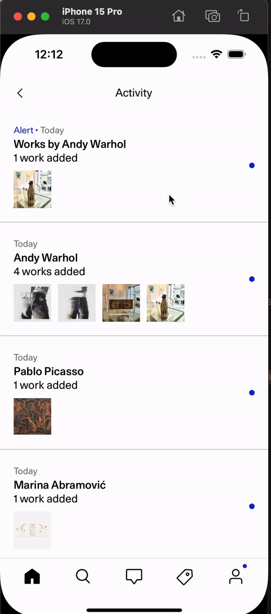
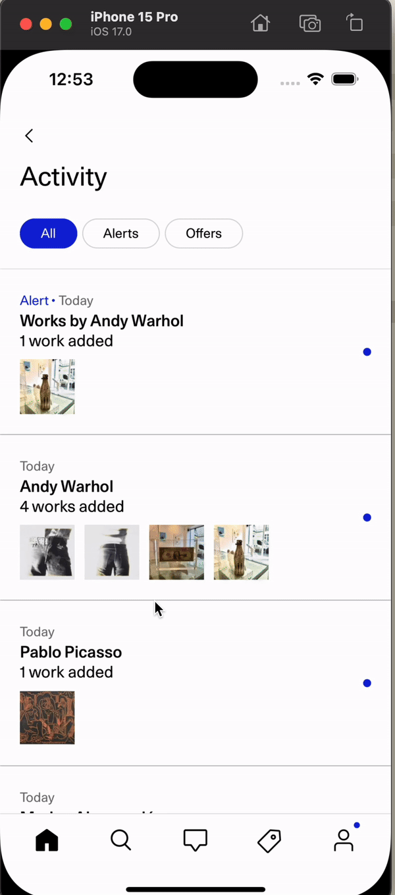

## Adding a new screen

When adding a new screen to Eigen, make sure to use `Screen` components coming from `palette-mobile`. Below is a list of examples of usage and how it should look like.

> If the specs offered to you do not match any of the components we use, please reach out to #practice-mobile to make sure we are aligned.

### Screen with Animated Header (Recommended)



```typescript
<Screen>
  <Screen.AnimatedHeader onBack={goBack} title="Activity" />
  <Screen.StickySubHeader title="Activity" />
  <Screen.Body fullWidth>{children}</Screen.Body>
</Screen>
```

Note: `Screen.StickySubHeader` Supports children components as well.

<details>
  <summary>Example</summary>



```typescript
<Screen>
  <Screen.AnimatedHeader onBack={goBack} title="Activity" />
  <Screen.StickySubHeader title="Activity" />
  <Screen.Body fullWidth>{children}</Screen.Body>
</Screen>
```

</details>

### Screen with Simple Header


```typescript
<Screen>
  <Screen.Header onBack={goBack} title="Activity" />
  <Screen.Body fullWidth>{children}</Screen.Body>
</Screen>
```

## Gotchas!

### Broken Virtualization due to Nested ScrollViews

The `Screen` component from `palette-mobile` exports multiple scroll handlers that can be anchored to your favourite ScrollView component to avoid nesting. You can access them using `Screen.useListenForScreenScroll()`

Example:

```typescript
const App = () => {
  return (
    <Screen>
      <Screen.AnimatedHeader onBack={goBack} title="Activity" />
      <Screen.StickySubHeader title="Activity" />
      <Screen.Body fullWidth>
        <ComponentWithScrollView />
      </Screen.Body>
    </Screen>
  )
}
```

- **Using a VirtualizedList from Screen**

```typescript
const ComponentWithScrollView = () => {
  const { scrollHandler } = Screen.useListenForScreenScroll()

  return (
    <Screen.FlatList
      {...props}
      onScroll={scrollHandler}
    >
  )
}
```

- **Using Your Own VirtualizedList**

```typescript
const ComponentWithScrollView = () => {
  const { scrollHandler } = Screen.useListenForScreenScroll()
  return (
    <AnimatedCustomVirtualizedList
      {...props}
      onScroll={scrollHandler}
    >
  )
}

const AnimatedCustomVirtualizedList = Animated.createAnimatedComponent(CustomVirtualizedList)
```
