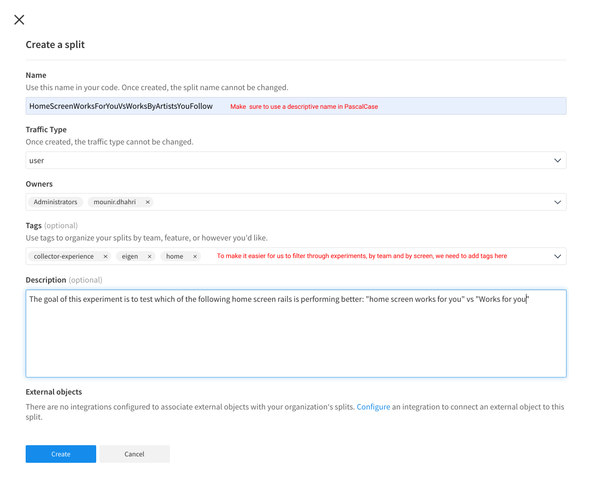
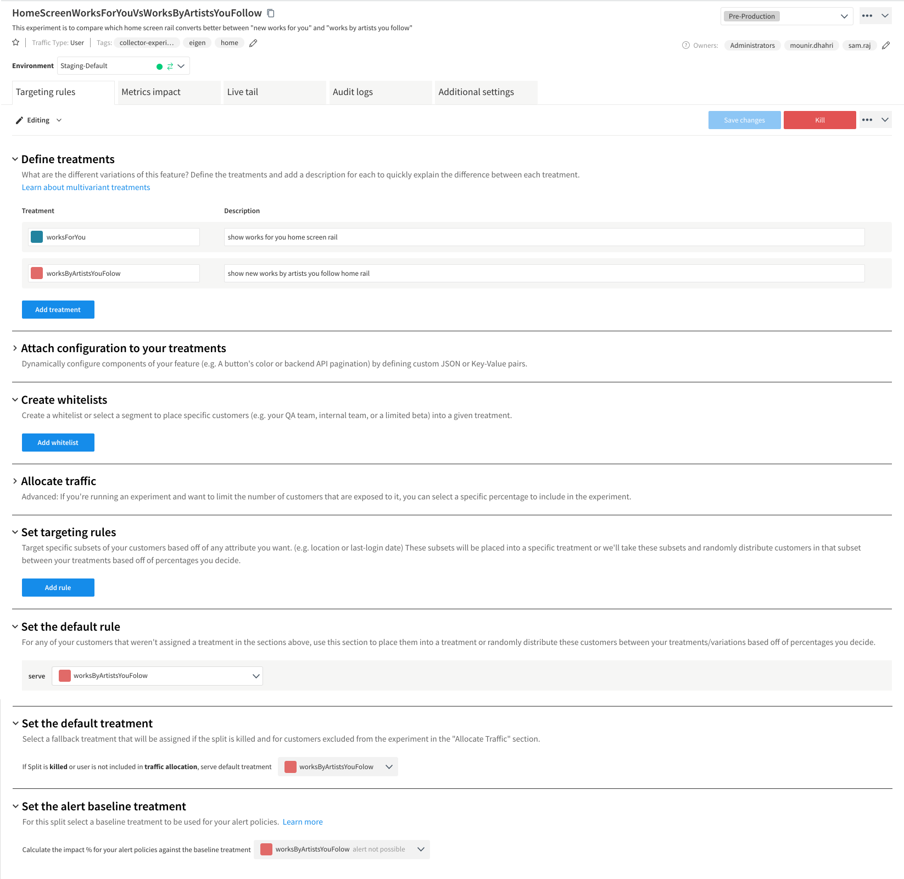
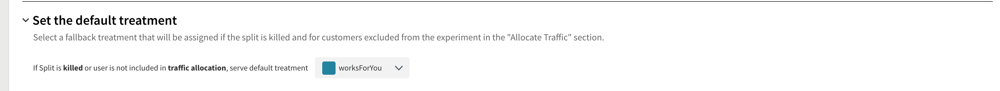

# Adding a New Experiment

We are using Split.io to run AB Testing experiments in Artsy. In order to create an experiment, we will need to first add it to the Split.io dashboard then make code adjustments to use it.

## Adding an experiment (aka Split) to Split.io dashboard

1. Log into your Split.io using your personal Artsy account
   `https://app.split.io/login`
2. Choose the **Splits** tab from the left menu
3. Tap on **Create split** and fill in required details as described in screenshot
   
4. Tap on **Add rules** and define your treatments.
   A _treatment_ refers to possible values for your experiment. The values are of `string` type.
   
5. Tap on **Save** and confirm while using **Pre-production** as a Status.

## Adding an experiment to Eigen

1. In the file `experiments.ts` add your new experiment.

```diff
   Treatment1VsTreatment2: {
     echoFlagKey: "Treatment1VsTreatment2",
     fallbackTreatment: "Treatment1"
   },
+  HomeScreenWorksForYouVsWorksByArtistsYouFollow: {
+    treatmentKey: "HomeScreenWorksForYouVsWorksByArtistsYouFollow",
+    fallbackTreatment: "worksByArtistsYouFolow",
+  },
```

_The `fallbackTreatment` refers to the value we would like to return in case something goes wrong with the client sdk_

## Using an experiment

In order to use an experiment, we have two custom hooks that we created that support querying for a single experiment (`useTreatment`).

### Querying for a single treatment

You can access the treatment value in a functional react component using `useTreatment`.

```diff
+ const treatment = useTreatment("HomeScreenWorksForYouVsWorksByArtistsYouFollow")
  return (
    <>
+    {treatment === "worksByArtistsYouFolow" && <WorksForYouRail />}
+    {treatment === "worksForYou" && <WorksForYouRail />}
    <>
  )
```

## Removing/Killing an Experiment

Once an experiment is done, usually we have a winner treatment. In order to roll out that treatment for everyone targeted by it, we will need to set it as a default treatment before "killing" it.

For example, in the previous experiment, we were testing if `worksForYou` is performing better than `worksByArtistsYouFolow`. Assuming that it actually did, we then set `worksForYou` as a default treatment, **Save changes**, then kill treatment by tapping on **Kill**


Then, all we need to do is remove any code that is relying on this experiment in Eigen.

## Still need help?

Ask for help in the #practice-mobile slack channel, we will be happy to assist!
