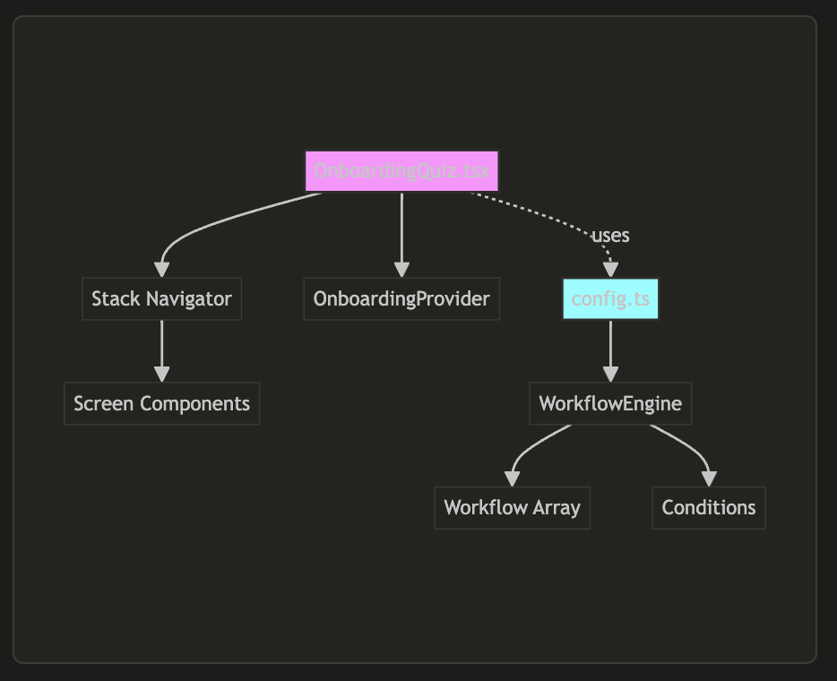

# Adding a New Screen to the Onboarding Workflow

This guide explains how to add a new screen to the onboarding workflow.

## Overview

The onboarding workflow consists of:

- **Stack Navigator** (`OnboardingQuiz.tsx`) - Manages screen navigation
- **Workflow Engine** (`config.ts`) - Controls the flow logic and screen order
- **Provider** (`OnboardingProvider`) - Contains state and actions



## Step-by-Step Guide

### Step 1: Create Your New Screen Component

Create a new file in `src/app/Scenes/Onboarding/OnboardingQuiz/` directory:

```typescript
// OnboardingYourNewScreen.tsx
import { StackScreenProps } from "@react-navigation/stack"
import { OnboardingNavigationStack } from "./OnboardingQuiz"
import { useOnboardingContext } from "./Hooks/useOnboardingContext"
import { OnboardingQuestionTemplate } from "./Components/OnboardingQuestionTemplate"

type Props = StackScreenProps<OnboardingNavigationStack, "OnboardingYourNewScreen">

const ANSWER_OPTIONS = [
  "Option 1",
  "Option 2",
  "Option 3"
]

export const OnboardingYourNewScreen: React.FC<Props> = () => {
  const { next } = useOnboardingContext()

  const handleNext = () => {
    next()
  }

  return (
    <OnboardingQuestionTemplate
      question="Your Question"
      subtitle="Optional subtitle"
      answers={ANSWER_OPTIONS}
      action="SET_YOUR_FIELD"
      onNext={handleNext}
    />
  )
}
```

### Step 2: Add Screen to Navigation Stack Type

Update the `OnboardingNavigationStack` type in `OnboardingQuiz.tsx`:

```typescript
export type OnboardingNavigationStack = {
  OnboardingWelcomeScreen: undefined
  OnboardingQuestionOne: undefined
  OnboardingQuestionTwo: undefined
  OnboardingQuestionThree: undefined
  ...
  OnboardingYourNewScreen: undefined // Add your new screen here
}
```

### Step 3: Import and Add Screen to Stack Navigator

In `OnboardingQuiz.tsx`, add:

```typescript
// Add import at the top
import { OnboardingYourNewScreen } from "./OnboardingYourNewScreen"

// Add screen to the navigator (placement depends on your flow)
<StackNavigator.Screen
  name="OnboardingYourNewScreen"
  component={OnboardingYourNewScreen}
/>
```

### Step 4: Update Workflow Configuration

In `config.ts`, you need to:

#### 4a. Add View Constant

```typescript
export const VIEW_YOUR_NEW_SCREEN = "VIEW_YOUR_NEW_SCREEN"
```

#### 4b. Add to Workflow Array

**Option 1: Add as a linear step**

```typescript
workflow: [
  VIEW_WELCOME,
  VIEW_QUESTION_ONE,
  VIEW_QUESTION_TWO,
  VIEW_YOUR_NEW_SCREEN, // Add here if it always appears
  VIEW_QUESTION_THREE,
  // ... rest of workflow
]
```

**Option 2: Add as a conditional branch**

```typescript
workflow: [
  VIEW_WELCOME,
  VIEW_QUESTION_ONE,
  VIEW_QUESTION_TWO,
  {
    DECISION_YOUR_CONDITION: {
      option1: [VIEW_YOUR_NEW_SCREEN],
      option2: [VIEW_QUESTION_THREE], // Skip new screen
    },
  },
  VIEW_QUESTION_THREE,
  // ... rest of workflow
]
```

#### 4c. Add Condition (if using conditional branch)

```typescript
conditions: {
  [DECISION_WHERE_WOULD_YOU_LIKE_TO_DIVE_IN]: () => {
    return basis.current?.questionThree || ""
  },
  // Add your new condition
  DECISION_YOUR_CONDITION: () => {
    // Return the option based on user state
    return basis.current?.someProperty === "someValue" ? "option1" : "option2"
  }
}
```

### Step 5: Handle Screen Navigation

The navigation is handled by the `useOnboardingContext` hook. When you call `next()`, it will:

1. Get the next screen from the WorkflowEngine
2. Navigate to that screen using React Navigation

```typescript
// In your screen component
const { next, back } = useOnboardingContext()

// To go forward
next()

// To go back
back()
```

### Step 6: Add Analytics Tracking (Optional)

If you need to track user interactions:

```typescript
import { useOnboardingTracking } from "./Hooks/useOnboardingTracking"

const { trackAnsweredQuestionOne } = useOnboardingTracking()

const handleNext = () => {
  // Track the user's selection
  trackAnsweredQuestionOne(selectedValue)

  next()
}
```

### Key Points for Conditional Navigation

1. **Decision Points**: Create a decision constant (e.g., `DECISION_SHOULD_SHOW_PRICE_RANGE`)
2. **Condition Function**: Return a string that matches one of your branch keys
3. **Branch Structure**: Each branch is an array of screens to show
4. **Flow Continuation**: After the conditional screens, the flow continues with the remaining workflow

## Testing Your New Screen

1. Run the app and go through the onboarding flow
2. Verify your screen appears in the correct order
3. Test navigation (next/back buttons)
4. Check that any state updates are saved properly
5. Verify analytics tracking is working
