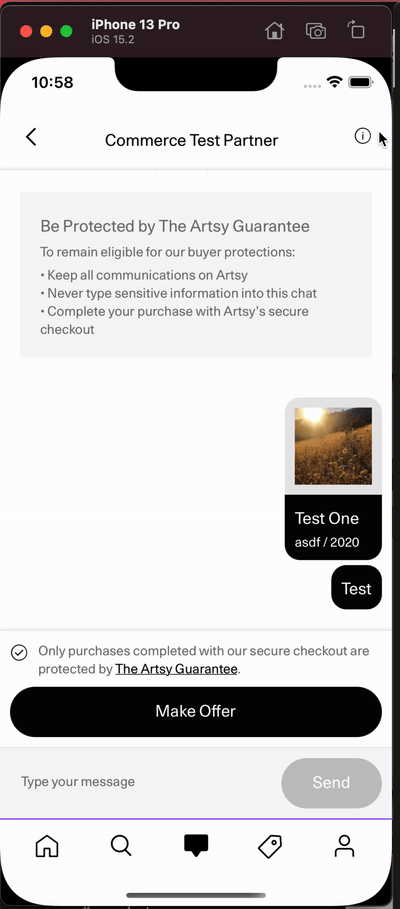
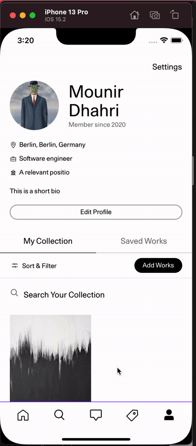

## Adding a new route

### Route in Eigen

In Eigen, as in many mobile apps, we have mainly two types for routes.

- Global app routes
- Context specific app routes

### Global Navigation functions

In `src/app/navigation/navigate.ts` we have helper functions we can globally use to navigate through the app. A good example is the `goBack()` helper which navigates you back to the previous global route you visited.

### Global App Routes

Global app routes in Eigen, are routes that are accessible everywhere in the app using the `src/app/navigation/navigate` helper.

Before making the decision of creating a new global route - make sure it is really needed. In many occasions, there is no need for it and using an independent Navigation container is all you need.

Example of situations where **you do need** to add a new route:

- You are working on a new feature that we might want to deep link users to
- You are adding a new native screen
- You are adding a new tab to the app

#### How to add a global app route

Add your screen to `routes.tsx`.

```typescript
export const artsyDotNetRoutes = defineRoutes([
  ...
  {
    path: "/my-screen-path",
    name: "MyScreen",
    Component: MyScreen,
    options: {
      screenOptions: {
        headerTitle: "My Screen Title",
      },
    },
  },
  ...
])
```

> [!IMPORTANT]
> If the screen you are adding has or will have a corresponding screen on artsy.net,
> the route should match the route on artsy.net and deeplinking should be enabled by adding the route to the AndroidManifest.xml.

Note: **[Android only]**: If you want to enable deep linking for your new screen, add the route to `src/main/AndroidManifest.xml`.

```xml
...
<data android:pathPrefix="/my-screen" />
...
```

### Context specific app routes

Context specific app routes in Eigen are routes that are part of an independent [NavigationContainer](https://reactnavigation.org/docs/navigation-container/). All routes defined inside a `NavigationContainer` context will receive a [navigation](https://reactnavigation.org/docs/navigation-prop/) and [route](https://reactnavigation.org/docs/glossary-of-terms/#route-prop) props which allow you to navigate through the different screens in a stack, listen to navigation events and also send params.

Example of situations where we should use an independent navigation container

- The screen you are adding is displaying content that can only be understood within a specific screen context.

  Examples:

  - Artwork Classification within the artwork screen
  <details><summary>Screenshot</summary>

  
  </details>

  - Inquiry information
  <details><summary>Screenshot</summary>

  
  </details>

- The screen you are adding, is a step for a specific action within the app and has logic that is tightly coupled to where it's being used.

  Example:

  - Select Artist, Select Artwork, Fill Artwork details are all screens that do not need to be added as a route. The flow of adding a work will obviously always start at the select artist screen and will contain all the other screens. In this case, we will need to add only one route to our app routes and the rest can all be handled using an independent navigation container.
  <details><summary>Screenshot</summary>

  
  </details>

#### How to add a content specific app route using a react-navigation independent navigationContainer

Inside the route that you would like to add the screens to, create a stack navigate as follows:

```typescript
export type MyScreenNavigationStackProps = {
  MyScreenFirstPage: undefined // You can as well specify navigation params here. Check react-navigation docs
  MyScreenSecondPage: undefined
  MyScreenThirdPage: undefined
}

const MyScreenStackNavigator = createStackNavigator<MyScreenNavigationStack>()

export const MyScreenNavigationStack = () => {
  return (
    <NavigationContainer independent>
      <MyScreenStackNavigator.Navigator
        screenOptions={{
          headerShown: false, // hide or show navigation header
          headerMode: "screen",
          // Add required screenOptions here. See https://reactnavigation.org/docs/group/#screenoptions
        }}
      >
        <MyScreenStackNavigator.Screen name="MyScreenFirstPage" component={MyScreenFirstPage} />
        <MyScreenStackNavigator.Screen name="MyScreenSecondPage" component={MyScreenSecondPage} />
        <MyScreenStackNavigator.Screen name="MyScreenThirdPage" component={MyScreenThirdPage} />
      </MyScreenStackNavigator.Navigator>
    </NavigationContainer>
  )
}
```

All screens inside the stack will now be able to get the `navigation` and `route` props as follows:

1. **Recommended way:** using `useNavigation` and `useRoute` props.

```typescript
const navigation = useNavigation<NavigationProp<MyScreenNavigationStack, "MyScreenFirstPage">>()
const route = useRoute<RouteProp<MyScreenNavigationStack, "MyScreenFirstPage">>()
```

2. Top level containers/components that are defined in the navigation stack, receive `navigation` and `route` as props. See the example below:

```typescript
interface MyScreenFirstPageProps
  extends StackScreenProps<
    MyScreenNavigationStack,
    "MyScreenFirstPage"
  > {
    // other props the page has
  }


const MyScreenFirstPage: React.FC<MyScreenFirstPageProps> = ({navigation, route}) => {
  ...
}
```

**Note** When using an independent navigation container, the state persistsence breaks between sessions and you need to handle it manually. See the example below

```typescript
import { useReloadedDevNavigationState } from "app/system/navigation/useReloadedDevNavigationState"
import { LoadingSpinner } from "app/Components/Modals/LoadingModal"

const MY_SCREEN_NAVIGATION_STACK_STATE_KEY = "MY_SCREEN_NAVIGATION_STACK_STATE_KEY"

export const MyScreenNavigationStack = () => {
  const { isReady, initialState, saveSession } =
    useReloadedDevNavigationState(MY_SCREEN_NAVIGATION_STACK_STATE_KEY)

  if (!isReady) {
    return <LoadingSpinner />
  }

  return (
    <NavigationContainer
      independent
      onStateChange={(state) => {
        saveSession(state)
      }}
      initialState={initialState}
    >
      {...}
    </NavigationContainer>
  )
}
```
