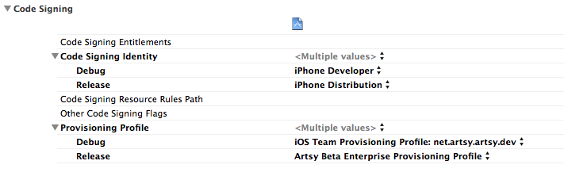
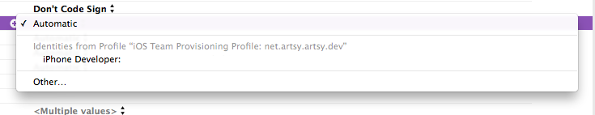
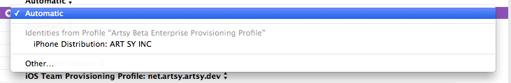

### Certificates & Profiles

#### Beta

* Provisioning Profile: `Artsy Beta Enterprise Provisioning Profile`
* Certificate: `iPhone Distribution: ART SY INC`, found in the Artsy Engineering 1Password vault. (For now, this is the Feb 25, 2018 one.)

##### Orta Therox - Wed 4 Sep 2013

### I can't get my provisional profiles set up

I've not had to do this from scratch in so long that I can't give any good advice. Xcode 5 should be able to do this automatically.

### What is the correct setup in Xcode for Code Signing

Note: This is on the _Project_ not the _Target_

So, Code Signing identiy is all automatic. This means that it will base the identity off the Provisioning profile below.

So for Debug it should take your personal account

And for Release it should use the Artsy Enterprise iPhone Distribution

The Xcode-generated `iOS Team Provisioning Profile: XXX` profiles are Dev profiles, and will not work with enterprise distribution. We have a `Artsy Enterprise Wildcard Dev Profile` profile which until we added notifications worked great, but as it is a wildcard you cannot use it with notifications. If you're writing in-house apps, this is what you want to use for simplicities sake.
