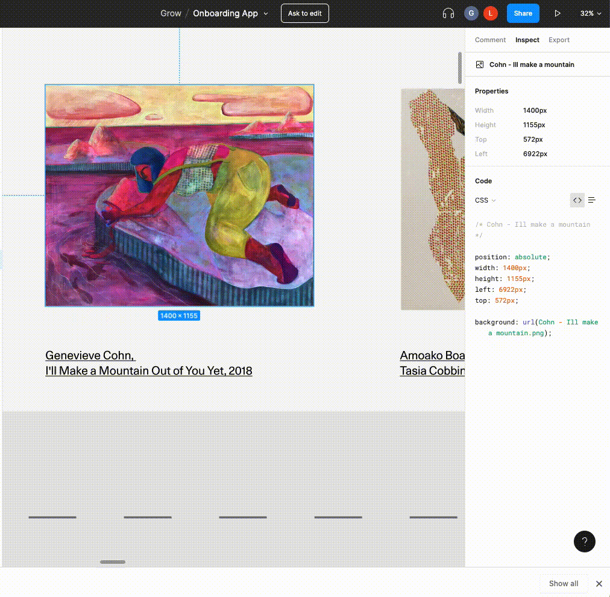

# Converting images from png to webp

In eigen we prefer using webp image format over png for lighter bundle size and better performance.

We have a script for converting the pngs that we drop in the `/images` directory.

## How to import an image from figma and convert it

1. Select the image in figma that you want to import in eigen.
2. On the right side click `export`
3. Press the `+` button 3 times for it to generate 3 files `my_image.png`, `my_image@2x.png`, `my_image@3x.png`
4. Press the export button



5. Unzip the file that was downloaded from figma and rename the image to your liking
   - **rename** the images and make sure to not have any spaces in the name
   - the names of the three images should be of this format `my_image.png`, `my_image@2x.png`, `my_image@3x.png`.
6. drag and drop the images to the /images directory in eigen

After that run the script after you cd to `eigen`

```bash
sudo ./scripts/utils/convert-png-images-to-webp.sh
```

And that's it! 🎉 🎉

### Misc

In order to convert the images we use `cwebp`.
If you want to learn more about cwebp click [here](https://developers.google.com/speed/webp/docs/cwebp)!
