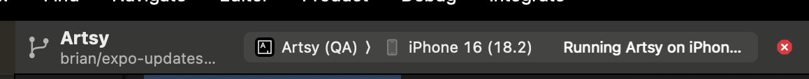

# Debugging Expo Updates (Devs)

The most common problem is fetching an update and it does not run or crashes on launch. This likely means the native code in the beta is different and is incompatible with the code that your update needs to run on.

**Note:** Native code includes not just our native code but any native code in dependencies our app relies on.

If:

- Your updates native code is **behind** the latest beta, try rebasing on main and redeploying your update
- Your updates native code is **ahead** of the latest beta, try deploying a new beta and redploying your update.

For other issues please reach out to #product-sapphire and feel free to update this doc!

# Debugging Expo Updates (Integration)

If something is going wrong with the expo updates integration or it needs to be updated it can be helpful debug downloading an update in a
dev build. For everyday use devs should not have to do this and should stick to running updates from betas.

This is a condensed version of the expo docs [here](https://docs.expo.dev/eas-update/debug/#ios-local-builds). Check the official docs if anything does not work.

### Local debug iOS build with expo updates

Set the debug flag in terminal and reinstall pods:

```
export EX_UPDATES_NATIVE_DEBUG=1
npx pod-install
```

Set flag in project to create a js bundle on every build:

```
sed -i '' 's/SKIP_BUNDLING/FORCE_BUNDLING/g;' ios/Artsy.xcodeproj/project.pbxproj
```

Run the application from Xcode using the Artsy (QA) scheme.
(This sets necessary config in Expo.plist for example the disableAntibrickingMeasures needs to be set in order to allow channel switching).



Deploy an update using these [instructions](./deploy_to_expo_updates.md) and pull down using the dev menu.

### Known gotchas

#### Code changes not auto refreshing app

The QA scheme uses bundled JS. To see any changes you will need to rebuild from Xcode; even then, Expo updates tend to use the latest downloaded update and you may have to delete the app and then rebuild.

#### Update is not applied after fetch

Expo updates has a bunch of native code checks to see if the local code is newer than the update it is trying to apply. These can be manually disabled by commenting out, or you can make sure you don't change any code after shipping an update, but this makes the feedback loop painful. Ask #product-sapphire for help if you have trouble.
