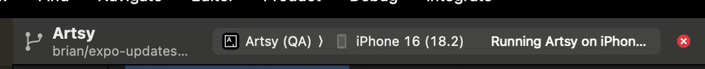

# Debugging Expo Updates (Devs)

The most common problem is your native code being incompatible with the build you're deploying to. The deploy script catches this up front by comparing fingerprints and refusing to publish (see [Deploying to Expo Updates](deploy_to_expo_updates.md#how-updates-are-matched-to-builds)); if it slips through, the update fetches but crashes on launch.

**Note:** Native code includes not just our native code but any native code in dependencies our app relies on.

If:

- Your updates native code is **behind** the latest beta, try rebasing on main and redeploying your update
- Your updates native code is **ahead** of the latest beta, try deploying a new beta and redploying your update.

For other issues please reach out to #product-sapphire and feel free to update this doc!

# Debugging Expo Updates (Integration)

If something is going wrong with the expo updates integration or it needs to be updated it can be helpful debug downloading an update in a
dev build. For everyday use devs should not have to do this and should stick to running updates from betas.

This is a condensed version of the expo docs [here](https://docs.expo.dev/eas-update/debug/#ios-local-builds). Check the official docs if anything does not work.

### Local debug iOS build with expo updates

Set the debug flag in terminal and reinstall pods:

```
export EX_UPDATES_NATIVE_DEBUG=1
bundle exec npx pod-install
```

Set flag in project to create a js bundle on every build:

```
sed -i '' 's/SKIP_BUNDLING/FORCE_BUNDLING/g;' ios/Artsy.xcodeproj/project.pbxproj
```

Run the application from Xcode using the Artsy (QA) scheme.
(This sets necessary config in Expo.plist for example the disableAntibrickingMeasures needs to be set in order to allow channel switching).



Deploy an update using these [instructions](./deploy_to_expo_updates.md) and pull down using the dev menu.

#### If you want to use lldb / xcode debugger

The QA configuration is a release configuration, code is optimized so debugging doesn't work properly, you can change the optimization level to None in build settings if you need this.

### Known gotchas

#### Deploy blocked with "Native code has drifted"

Expected, not a bug — your branch's native code doesn't match the build the update would land on, and publishing anyway would crash it on launch. Rebase or deploy a new beta depending on which side is stale, per [Debugging Expo Updates (Devs)](#debugging-expo-updates-devs) above.

If you're deploying from a branch that isn't based on current main — a hotfix branch cut from a release tag, say — then the default comparison against the latest beta is the wrong one. Use `--check-against-version` to compare against the shipped build for the current app version instead.

#### Code changes not auto refreshing app

The QA scheme uses bundled JS. To see any changes you will need to rebuild from Xcode; even then, Expo updates tend to use the latest downloaded update and you may have to delete the app and then rebuild.

#### Update is not applied after fetch

Expo updates has a bunch of native code checks to see if the local code is newer than the update it is trying to apply. These can be manually disabled by commenting out, or you can make sure you don't change any code after shipping an update, but this makes the feedback loop painful. Ask #product-sapphire for help if you have trouble.

#### Crash on launch after switching channels

In dev mode there are assertions for valid state transitions that fail after switching channels, this may be a bug worth investigating and possibly PR back to expo?
To get arround it you can comment out the assertions in the transition function in UpdatesStateMachine.swift when debugging in dev.

#### Android: `expoUpdatesDisableAntibrickingMeasures` must stay `"false"` on beta builds

`android/app/build.gradle`'s `beta` build type must keep `expoUpdatesDisableAntibrickingMeasures: "false"`.
Flipping it to `"true"` opens two separate bugs in expo-updates 55.0.22's Android code, depending on
which override API you call. Neither has a safe workaround, so leave the flag alone.

**NPE from `setUpdateURLAndRequestHeadersOverride`.** `getUpdateUrl()` in `UpdatesConfiguration.kt` has a
bug. When the flag is `true`, `configOverride?.let { return it.updateUrl }` returns as soon as an
override object exists, even if `it.updateUrl` is itself `null`, which it is for a headers-only
override. That `null` gets force-unwrapped one line later and throws a `NullPointerException`. iOS's
equivalent doesn't have this bug. It uses `if let updateUrl = configOverride?.updateUrl` there, which
falls back to the embedded URL when the override didn't set one.

**`ERR_UPDATES_RELOAD` from `setUpdateRequestHeadersOverride`.** With the flag `true`, saving any
override, headers-only included, makes `getHasEmbeddedUpdate()` return `false` on the next launch, so
`DatabaseLauncher` drops the embedded update from the launchable set. On a beta that hasn't downloaded
an update yet, that leaves zero launchable updates, and the app falls back to an emergency launch with
no launched update. The dev menu shows this as `isEmergencyLaunch: true` under "Active Release". The
beta build type also sets `checkOnLaunch: "NEVER"`, so there's no remote check to recover from this.
`Updates.fetchUpdateAsync()` still downloads fine, but Android's `relaunchReactApplicationForModule`
hard-guards on having a launched update and rejects `reloadAsync()` with `Cannot relaunch without a
launched update` (`ERR_UPDATES_RELOAD`). iOS's `requestRelaunch` has no such guard, which is why this
only happens on Android.

If you land in this state, either the dev menu shows "Emergency Launch: Yes" or "Fetch and Run
Deployment" throws `ERR_UPDATES_RELOAD`. Force-quit and reopen the app. The update already downloaded,
so a cold start will pick it up. The dev menu's "Reset Channel Override" button clears the saved
override and prompts the same restart, for switching back to the embedded channel specifically.

If a future expo-updates upgrade fixes either of these upstream, this flag is safe to flip back. We
only ever call the headers-only override API from the dev menu, never the URL one.
