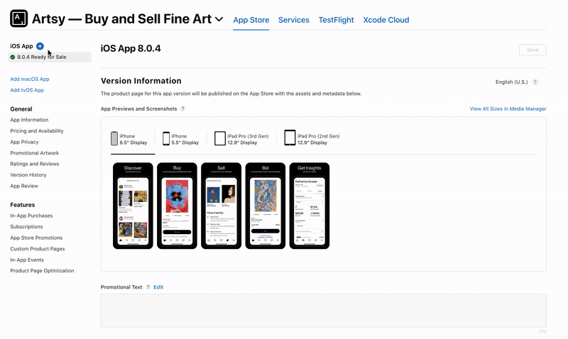

# Deploy to App Store

App Store builds have to go through the beta process first. [Check out the beta docs](./deploy_to_beta.md) for more info.

## Test the Beta

Eigen's beta pre-submission checklist has [moved into Notion 🔐](https://www.notion.so/artsy/Pre-submission-QA-Checklist-785e3233fdcf423f95ee239ab3c22ec3).

## Preparing to Ship a Final Version

1. Start a branch from main.
2. Update [`release_notes.txt`](https://github.com/artsy/eigen/blob/main/fastlane/metadata/en-US/release_notes.txt) with the **user-facing** release notes for this version.
   - See [previous examples](https://github.com/artsy/eigen/commits/main/fastlane/metadata/en-US/release_notes.txt) of release notes.
   - Share the notes with the #practice-mobile channel in Slack for feedback.
   - Commit, push the changes, make a PR from your branch to main.
3. Run `./scripts/deploys/promote-beta-to-submission-ios`. This will submit the **most recent beta** for App Store review

Our App Store releases are set to release automatically once Apple approves the app. You can check the status of the build in app store connect, a message will also be sent to mobile [at] artsymail [dot] com once the app is approved.

4.  Make sure to let the team know over at [#dev 🔐](https://artsy.slack.com/archives/C02BC3HEJ)!. Don't forget to thank everyone who contributed 💜

## Prepare for the Next Release

1. Create a new version of the app in AppStoreConnect (if you don't do this, beta deployments will fail).
   - Go to "My Apps", click Eigen ("Artsy: Buy & Sell Original Art"), click "+ version or platform", click "iOS", and enter version number.
     > Wait to start with this flow, since you can only create a new version once the previous app version has been approved/rejected!

2. Run `./scripts/deploys/next`. This prompts for the next version number. **Use the same version as the previous step**.
3. Add and commit the changed files, typically with `-m "Preparing for development, version X.Y.Z."`.
4. Run `./scripts/deploys/deploy-beta-ios` to trigger a new beta. (When we add a new version, the first beta goes through additional TestFlight review by Apple. By trigger the beta now, we go through that review early, and avoid delaying future QA sessions.)
5. PR your changes back into the `main` branch.
