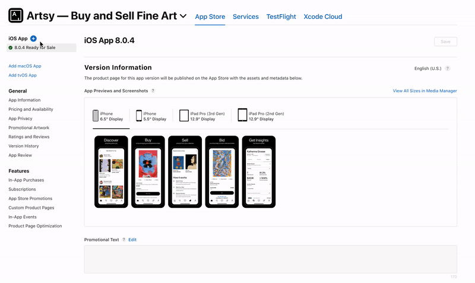

# Deploy to App Store

App Store builds have to go through the beta process first. [Check out the beta docs](./deploy_to_beta.md) for more info.

## Test the Beta

QA happens against the release-candidate beta, in the Mobile App QA document that CI creates for each release. The full runbook is [Release Captain Tasks 🔐](https://www.notion.so/artsy/Release-Captain-Tasks-7ca3e6f5d16e41079a1fb1b1706bd018); see also [release candidate code freeze](release_candidate_code_freeze.md) for the branch mechanics.

## Preparing to Ship a Final Version

1. Check out the release-candidate branch for this release, `rc-vX.Y.Z` — **not** a fresh branch from `main`. Everything for the release lives on that branch so the code we submit is the code we QA'd.
2. Update [`release_notes.txt`](https://github.com/artsy/eigen/blob/main/fastlane/metadata/en-US/release_notes.txt) with the **user-facing** release notes for this version.
   - See [previous examples](https://github.com/artsy/eigen/commits/main/fastlane/metadata/en-US/release_notes.txt) of release notes.
   - The release notes are gathered in a #practice-mobile thread the day before code freeze; ask there for a final copy if anything is unclear.
   - Commit and push to `rc-vX.Y.Z`.
3. Run `./scripts/deploys/promote-beta-to-submission-ios`. This submits the **most recent iOS beta** for App Store review — so make sure the most recent beta is the one you QA'd, i.e. that nobody deployed a beta off `main` after the release candidate was built. Check with `./scripts/deploys/latest-betas` if you're unsure.
   - Fastlane tags the submission (`ios-<version>-<build>-submission`) and pushes the tag as part of this lane.
   - Once the release has shipped, open a PR from `rc-vX.Y.Z` into `main` so the release-notes change (and any fixes authored on the RC branch) make it back.

Our App Store releases are set to release automatically once Apple approves the app. You can check the status of the build in app store connect, a message will also be sent to mobile [at] artsymail [dot] com once the app is approved.

4.  Make sure to let the team know over at [#dev 🔐](https://artsy.slack.com/archives/C02BC3HEJ)!. Don't forget to thank everyone who contributed 💜

## Prepare for the Next Release

**This is normally automatic.** `./scripts/deploys/create-next-version-if-needed` runs nightly on CI (the `nightly` workflow in `.circleci/config.yml`): once the release is approved it creates the next version in App Store Connect and opens a PR bumping the version in the app code, announced in #practice-mobile. Merge that PR and you're done.

Manual fallback — if #practice-mobile says the next version could not be created

1. Create a new version of the app in AppStoreConnect (if you don't do this, beta deployments will fail).
   - Go to "My Apps", click Eigen ("Artsy: Buy & Sell Original Art"), click "+ version or platform", click "iOS", and enter version number.
     > Wait to start with this flow, since you can only create a new version once the previous app version has been approved/rejected!

2. Run `./scripts/deploys/next`. This prompts for the next version number. **Use the same version as the previous step**.
3. Add and commit the changed files, typically with `-m "Preparing for development, version X.Y.Z."`.
4. Run `./scripts/deploys/deploy-beta-ios` to trigger a new beta. (When we add a new version, the first beta goes through additional TestFlight review by Apple. By triggering the beta now, we go through that review early, and avoid delaying future QA sessions.)
5. PR your changes back into the `main` branch.

