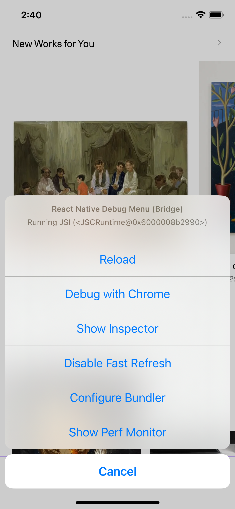

# Dev Menu

Eigen has two developer menus:

- The regular react-native In-App Developer Menu
- Our own Dev Settings Menu.

## Our Dev Settings Menu

This is a custom menu that we use for all our in house built-in debugging features (clearing relay cache, throwing sentry errors, showing analytics events ...etc) in addition to enabling/disabling feature flags.

By default, this menu is disabled if you are running the app in a production build or if you are on staging in a non-artsy mail account. To enable it:

1. Run the app in the simulator or a real device.
   1a. Developer mode should be on in you are developing (`__DEV__` is true, or you are logged in with an artsy email). Make sure it is, by going to Profile > About. If "Version" has a one pixel purple line on the right, then you are good to go. If not, then you need to tap "Version" 7 times quickly, to enable developer mode.
2. **iOS** Simulate a ‘shake’ event (<kbd>^⌘Z</kbd>), which will bring up the Dev Menu.
3. **Android** Tap on any element in the app 7 times quickly, and it will open the Dev Menu.

## React - Native Developer Menu

You can access the dev menu only on the development environment via keyboard shortcuts or by shaking the device.

### How to access it

##### Keyboard shortcuts:

- iOS Simulator: <kbd>⌘D</kbd>
- Android Emulator: <kbd>⌘M</kbd>

##### Opening via our Dev Settings Menu:

- simulate a 'shake' event <kbd>^⌘Z</kbd> , which will bring up the Dev Menu and then press

### Options

- Reload: Reloads the app
- Debug with Chrome: connects the bundler with Chrome / React - Native Debugger or VSCode in order to debug with breakpoints.
- Show Inspector: opens the React Native Inspector
