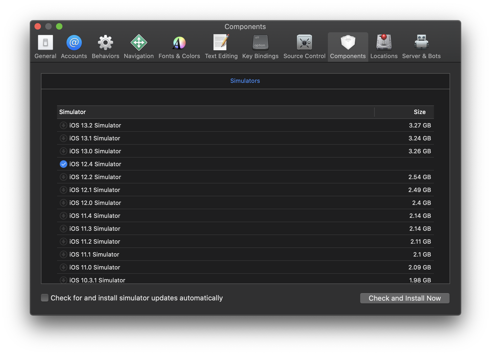

## Getting Setup

### Prerequisites

You'll need [Node](https://nodejs.org/en/) and [Yarn](https://yarnpkg.com/en/) installed. The Node version should match [the `engine` version here](https://github.com/artsy/emission/blob/master/package.json).

### Xcode Version

Currently we require developers to use Xcode 11, with the latest version (11.3) recommended. You can find all versions of Xcode from [Apple's Developer Portal 🔐](http://developer.apple.com/download/more/).

### Clone

Follow the instructions in [the README](https://github.com/artsy/eigen).

### Running Tests

We can only run tests in one specific environment, today that is iPhone X with the iOS 12.4 Simulator. This is because we use visual snapshots for UI regressions.

You can install the iOS 12 SDK by opening Xcode's preferences, going to "Components" then downloading "12.4".

<p align="center">
  
</p>

Once it's all downloaded, it will show up in the dropdown in the top left corner.

<p align="center">
  
</p>

#### To run test in Xcode

Tap `cmd + u` to run all tests, use `ctrl + alt + cmd + g` to run the last set you clicked on via the GUI.

#### Command line

You can run tests via the CLI using:

```sh
make test
```

#### Updating snapshots

We use [Nimble-Snapshots](https://github.com/ashfurrow/Nimble-Snapshots) to take screenshots while running tests and
these screenshots are checked in to the source control. When you change e.g. the background color of a particular
button, it calculates the diff between two screenshots and makes the test fail if the delta is above a certain
threshold.

In order to update existing screenshots, replace individual calls to `haveValidSnapshot()` with `recordSnapshot()`,
or you can change `switchChecksWithRecords` to `true` in `HaveValidSnapshot.swift` (this is a CocoaPod, Xcode will
warn you about changing a locked file). The location of the file could be looked up by:

```
tree -f Pods | grep HaveValidSnapshot
```

For updating Objective-C snapshots, you'll need to do the same work but on a file named `EXPMatchers+FBSnapshotTest.m`.
### Certificates

We use Xcode's auto-codesigning. It should magically "just work" if you log in to Xcode with an iTunes account
which is on the Artsy team.

We have [cert troubleshooting here](https://github.com/artsy/eigen/blob/master/docs/certs.md)

### Connecting a device

Xcode will prompt you to join a team, then to enable the device for development. When If you have to choose a team, choose _Art.sY Inc._.

### Reading more

Learn about what things are architecturally [here](https://github.com/artsy/eigen/blob/master/docs/overview.md), then move [to the blog.](http://artsy.github.io/blog/categories/eigen/) for more in-depth discussions on Eigen.

## Use the developer springboard function

Edit `Artsy/Classes/View Controllers/ARTopMenuViewController+DeveloperExtras.m` with any custom code that you would like to run on application startup. For example, you may want to load a specific Fair with the following code.

```objc
- (void)runDeveloperExtras
{
    UIViewController *controller = [ARSwitchBoard loadFairWithID:@"the-armory-show-2014"];
    [self.navigationViewController pushViewController:controller animated:YES];
}
```

Run `git update-index --assume-unchanged "Artsy/Classes/View Controllers/ARTopMenuViewController+DeveloperExtras.m"` to ignore changes on this file.
