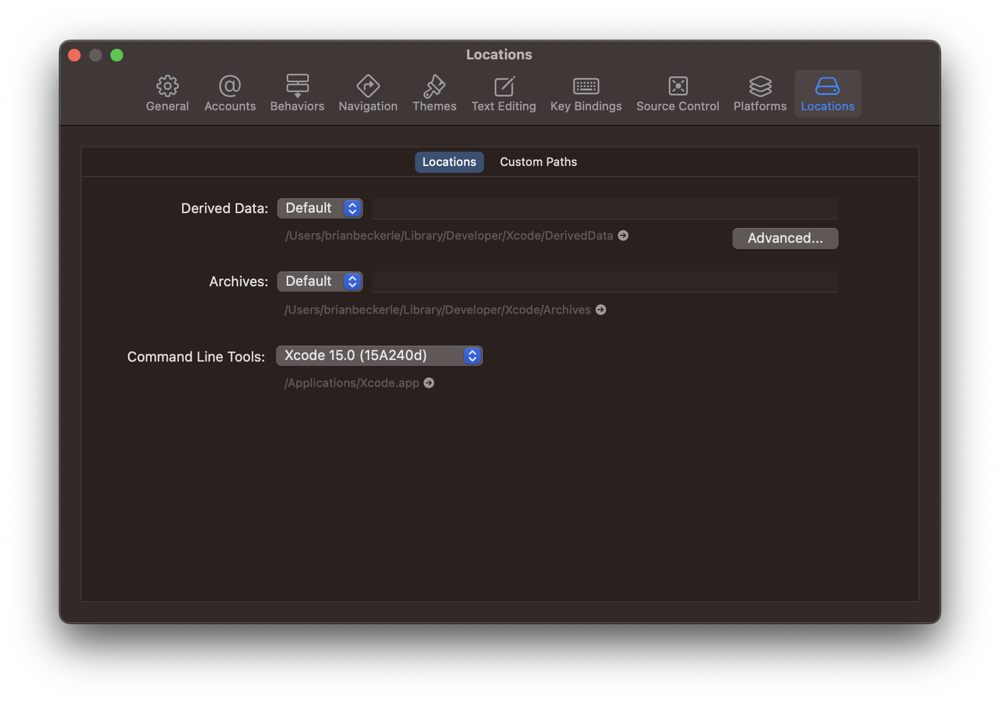

# Getting Started

### Prerequisites

You'll need [homebrew](https://brew.sh) [asdf](https://asdf-vm.com/guide/getting-started.html), [Yarn](https://yarnpkg.com/en/) and Watchman installed (`brew install watchman`).

#### Setting up asdf

There are instructions here: https://asdf-vm.com/guide/getting-started.html
You will want the java, nodejs, and ruby plugins to get all of our tooling.

```
brew install asdf
# configure your shell setup scripts for your shell, see asdfs instructions on the site
asdf plugin add ruby
asdf plugin add nodejs
asdf plugin add java
```

### Set up iOS

Download Xcode version 15. You can find all available versions of Xcode at [Apple's Developer Portal 🔐](http://developer.apple.com/download/more/).

Ask your mentor to add you on the [firebase.console](https://console.firebase.google.com/project/eigen-a7d3b/settings/iam) to be able to release.

<details><summary>NOTE: After installing Xcode</summary>

Check that Command Line Tools version is added in the Locations tab. Xcode>Settings>Locations:


</details>

### Set up Android

> [!IMPORTANT]
> We use asdf for managing java, you can skip the section in the docs below around the Java Development Kit. Instead do:
>
> `asdf install` in the eigen directory.
>
> then set JAVA_HOME in you shell config (e.g. .zshrc) to the asdf java install path.
>
> find that path by running:
>
> `asdf where java`
>
> and then add to your shell config:
>
> `export JAVA_HOME="<YOUR-ASDF-JAVA-PATH-HERE>"`

1. Android development environment: Follow the [official docs](https://reactnative.dev/docs/environment-setup). Select "React Native CLI Quickstart" tab

2. [Create a virtual device](https://developer.android.com/studio/run/managing-avds) on which to run the Android app.

## Run Eigen

### Get eigen

```
git clone https://github.com/artsy/eigen.git
cd eigen
```

### Install the dependencies

<details><summary>Work at Artsy?</summary>

1. Run

```
asdf install
yarn setup:artsy
yarn install:all
yarn relay
```

You will need [awscli](https://formulae.brew.sh/formula/awscli) to get our ENV vars.

</details>

<details><summary>Independent Contributor?</summary>

#### Set up awscli

You will need [awscli](https://formulae.brew.sh/formula/awscli) to get our font files.
You can configure it with a personal user account.

#### Set up your env file and download assets:

```sh
yarn setup:oss # this is `yarn setup:artsy` if you're working at Artsy
```

#### Get a mapbox token and set it in .env.shared:

You can create an account on mapbox and get a token with their free tier:

Follow the instructions here: https://docs.mapbox.com/ios/maps/guides/install.

Add the token to .env.shared as MAPBOX_DOWNLOAD_TOKEN

#### Install dependencies and generate relay files:

```sh
yarn install:all
yarn relay
```

### Known limitations

Some third party services will not function when working as an open source contributor including but not limited to Braze, Unleash, Sentry and Google Sign In. The conversations tab and related features are also inaccessible. Thanks for supporting open source!

</details>

**Note**: `yarn pod-install` (which is included in `yarn install:all`) may fail the first time you run it (due to a [bug](https://github.com/orta/cocoapods-keys/issues/127) in a dependency of ours). Re-running the command should work.

## Troubleshooting

If there are issues setting up the app, see the [troubleshooting doc](troubleshooting.md).

## Contribute

We welcome independent contributions! Feel free to open an issue and open a PR and assign one of [Brian Beckerle](https://github.com/brainbicycle), [George Kartalis](https://github.com/gkartalis), [Mounir Dhahri](https://github.com/MounirDhahri) as a reviewer or anyone else listed [here](https://github.com/artsy/eigen#meta).

If you work at Artsy you can find a ticket on [CX backlog 🔐](https://artsyproduct.atlassian.net/jira/software/c/projects/CX/boards/77/backlog?issueLimit=100) and look for a **#good-first-issue**

## Run the app

Start the react-native bundler:

```sh
yarn start
```

### Run the iOS app

First, ask for your apple developer account to be added on the project and login with your apple id under settings/accounts/apple Id.

#### Using Xcode

Open the app in Xcode:

```sh
open ios/Artsy.xcworkspace
```

From Xcode, run the app by hitting `Product > Run` (or ⌘R). This will start the Artsy app in an iOS simulator, pointed at Artsy's staging environment.

#### Using terminal

> Make sure that you have a simulator running before running the command. In order to do so you can use the `yarn open-sim` command

```sh
yarn ios
```

#### Flipper

Once you've built & run the app through Xcode once, you can use [Flipper](https://fbflipper.com/) to run/debug the iOS app locally. This is typically much faster than running through Xcode.

Make sure Flipper is running, then start the iOS simulator directly via your terminal:

```sh
yarn open-sim
```

The simulator that opens should include the Artsy app even if you don’t have xcode running, and then you can use Flipper's dev tools for inspecting log output.

Occasionally you'll need to rebuild the app in Xcode for Flipper. The most likely scenario that requires a rebuild is that you’ve pulled latest, run bundle exec pod install, and dependency versions were updated in Podfile.lock.

**Note**: You'll want to confirm that the above command started the same simulator that you last ran in xcode, i.e. iPhone 12 vs iPhone 12 max. If it didn't, you can choose the correct simulator from `File|Open|…`

**Note**: The Artsy app icon is on the _second_ screen of the simulator, not the first, so make sure you swipe over to find it.

### Run the Android app

```sh
yarn android
```

This will start the Artsy app in an Android emulator, pointed at Artsy's staging environment.

#### Wifi setup on Android emulators

In order to have internet access on android emulator you need to add Google's DNS servers to your device's network settings. You can do that by following these steps:

1. Click Apple menu > System Preferences > Search for DNS.
1. Click DNS Domains.
1. Select the DNS tab.
1. Add 8.8.8.8 and 8.8.4.4
1. Click OK > Apply.
1. Restart the emulator with **cold boot** now. (Android Studio > Device Manager > Three Dots (settings) > Cold Boot Now)

> :warning: You might need to run the last step above after you get setup with [Artsy's VPN](https://www.notion.so/artsy/VPN-Configuration-60798c292185407687356997bf251d8c) or if you edit your DNS settings!

## Run native tests

We can only run tests in one specific environment, today that is iPhone 12 Pro with the iOS 14.2 Simulator. This is because we use visual snapshots for UI regressions.

### Run tests in Xcode

Tap `cmd + u` to run all tests, use `ctrl + alt + cmd + g` to run the last set you clicked on via the GUI.

### Run tests via command line

You can run tests via the CLI using:

```sh
./scripts/ci/test-ios
```

## Certificates

We use Xcode's auto-codesigning. It should magically "just work" if you log in to Xcode with an iTunes account
which is on the Artsy team.

We have [cert troubleshooting here](https://github.com/artsy/eigen/blob/main/docs/certs.md)

## Connect a device

### iOS

When you connect an iPhone to your machine, Xcode will prompt you to join a team, then to enable the device for development. If you have to choose a team, choose _Art.sY Inc._.

### Android

1. On your Android device go to Settings > About Phone
2. Find the 'Build number' menu item and tap it 7 times to enable developer mode.
3. Now go to Settings > System > Developer Options, and turn on 'USB Debugging'
4. Connect your device to your computer via USB cable. After a moment the device should show a prompt for you to allow USB debugging for your computer. Press yes.
5. After that run `yarn android` from within the eigen directory. This will build the app, install it on your device, and run it.

## Read more

Learn about what things are architecturally [here](https://github.com/artsy/eigen/blob/main/docs/overview.md), then move [to the blog.](http://artsy.github.io/blog/categories/eigen/) for more in-depth discussions on Eigen.

## Steps To Upgrade `react-native` to 0.73.9 on your machine:

#### JAVA:

For asdf users:

```sh
asdf install
```

For non-asdf users:

```sh
brew install --cask zulu@17

# Get path to where cask was installed to double-click installer
brew info --cask zulu@17
```

> [!IMPORTANT]
> For all (asdf/ non asdf users). After you install the JDK, update your JAVA_HOME environment variable in your `.zshrc` file. Afterwards run `source ~/.zshrc` to make it effective and restart your terminal.
> If you used above steps, JDK will likely be at /Library/Java/JavaVirtualMachines/zulu-17.jdk/Contents/Home.
> You can try out in the terminal by typing $JAVA_HOME to make sure that it was updated properly.

#### Before running the app and in order to install without any caching issues

```sh
# Delete node modules and caches:
rm -rf node_modules && rm -rf .cache && rm -rf "$TMPDIR/metro*" && rm -rf "$TMPDIR/haste-map-*"

# install all the dependencies needed
yarn install:all

# you will most likely have to run also the following to bump hermes-engine:
cd ios && bundle exec pod update hermes-engine --no-repo-update & cd ..
```

#### Read more on proper environmet setup

You can also find more information on how to properly setup your environment for react native in [this official doc](https://reactnative.dev/docs/0.73/environment-setup).
