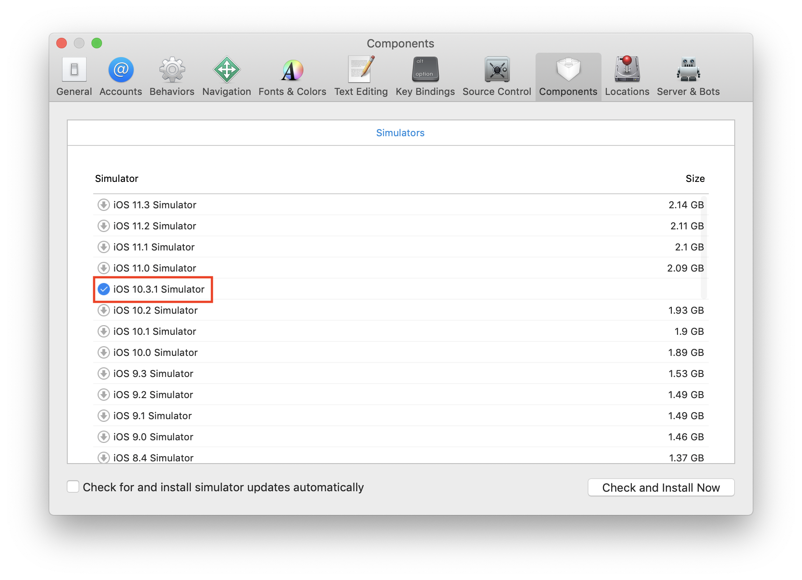
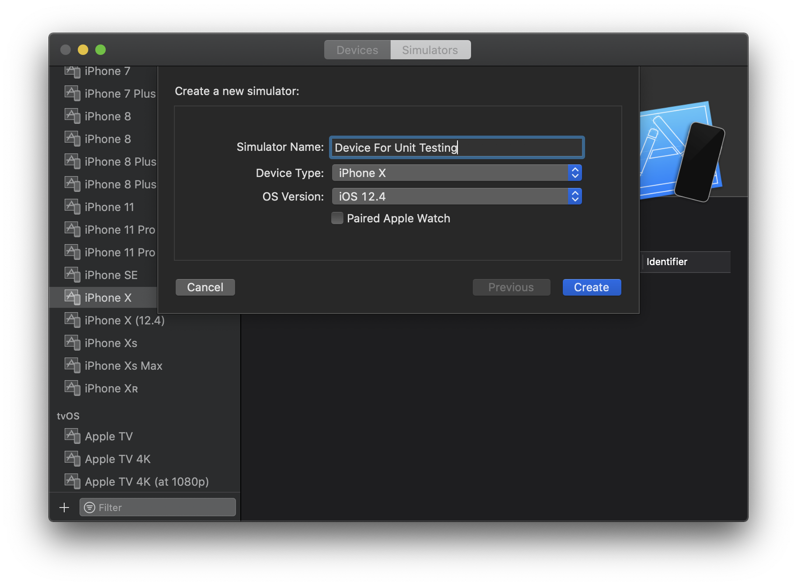

## Getting Setup

### Xcode Version

Currently we require developers to use Xcode 10, with the latest version (10.3) recommended. You can find all versions of Xcode from [Apple's Developer Portal 🔐](http://developer.apple.com/download/more/).

### Fork and Clone

Follow the instructions in [the README](https://github.com/artsy/eigen).

### Running Tests

We can only run tests in one specific environment, today that is `10.3` on an iPhone 6. This is because we use visual snapshots for UI regressions.

You can install the iOS 10 SDK by opening Xcode's preferences, going to "Components" then downloading "10.3.x".

<p align="center">
  
</p>

Once it's all downloaded, it will show up in the dropdown in the top left corner.

<p align="center">
  
</p>

#### To run test in Xcode

Tap `cmd + u` to run all tests, use `ctrl + alt + cmd + g` to run the last set you clicked on via the GUI.

#### Command line

You can run tests via the CLI using:

```sh
make test
```

### Certificates

We use Xcode's auto-codesigning. It should magically "just work" if you log in to Xcode with an iTunes account
which is on the Artsy team.

We have [cert troubleshooting here](https://github.com/artsy/eigen/blob/master/docs/certs.md)

### Connecting a device

Xcode will prompt you to join a team, then to enable the device for development. When If you have to choose a team, choose _Art.sY Inc._.

### Reading more

Learn about what things are architecturally [here](https://github.com/artsy/eigen/blob/master/docs/overview.md), then move [to the blog.](http://artsy.github.io/blog/categories/eigen/) for more in-depth discussions on Eigen.
