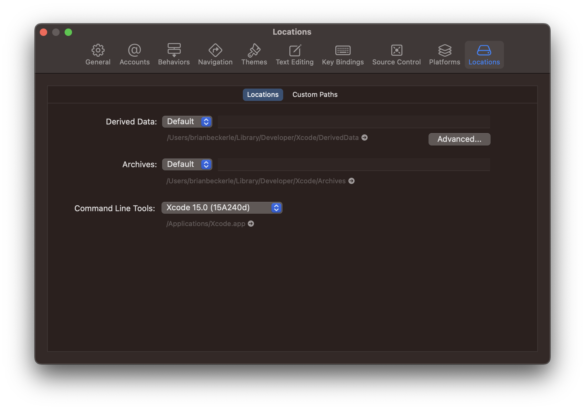

# Getting Started

It is recommended to follow the steps for a fresh environment setup from the [react native docs](https://reactnative.dev/docs/set-up-your-environment) depending on the version that you are aiming to develop for.

### Prerequisites

You'll need [homebrew](https://brew.sh), a runtime manager ([mise](https://mise.jdx.dev/) — preferred — or [asdf](https://asdf-vm.com/guide/getting-started.html)), [Yarn](https://yarnpkg.com/en/) and Watchman installed (`brew install watchman`).

We pin the versions of java, nodejs and ruby in `.tool-versions`. Both mise and asdf read that file, so either tool will install the correct versions.

#### Setting up mise (preferred)

Full instructions: https://mise.jdx.dev/getting-started.html

```
brew install mise
# ...or, without homebrew: curl https://mise.run | sh

# activate mise in your shell (zsh shown here — see the mise docs for other shells)
echo 'eval "$(mise activate zsh)"' >> ~/.zshrc && source ~/.zshrc

# from the eigen directory, install the pinned tool versions
mise install
```

mise uses PATH-based activation (not shims) by default, so there's no reshim step. It has built-in support for node, ruby and java — no plugins to add. `mise install` reads `.tool-versions` and installs everything.

#### Setting up asdf (alternative)

There are instructions here: https://asdf-vm.com/guide/getting-started.html
You will want the java, nodejs, and ruby plugins to get all of our tooling.

```
brew install asdf
# configure your shell setup scripts for your shell, see asdfs instructions on the site
asdf plugin add ruby
asdf plugin add nodejs
asdf plugin add java
```

### Set up iOS

Download Xcode version 26.2 (the version CI builds against — see `ios-config.json`). You can find all available versions of Xcode at [Apple's Developer Portal 🔐](http://developer.apple.com/download/more/).

Ask your mentor to add you on the [firebase.console](https://console.firebase.google.com/project/eigen-a7d3b/settings/iam) to be able to release.

<details><summary>NOTE: After installing Xcode</summary>

Check that Command Line Tools version is added in the Locations tab. Xcode>Settings>Locations:


</details>

### Set up Android

> [!IMPORTANT]
> We manage java with our runtime manager (mise or asdf), so you can skip the section in the docs below around the Java Development Kit. Instead, from the eigen directory:
>
> **mise (preferred):** run `mise install`. mise activation sets `JAVA_HOME` automatically — no extra step needed. Confirm with `echo $JAVA_HOME`.
>
> **asdf:** run `asdf install`, then set `JAVA_HOME` in your shell config (e.g. `.zshrc`) to the asdf java install path. Find it with `asdf where java`, then add:
>
> `export JAVA_HOME="<YOUR-ASDF-JAVA-PATH-HERE>"`

1. Android development environment: Follow the [official docs](https://reactnative.dev/docs/set-up-your-environment?platform=android). Select "React Native CLI Quickstart" tab

2. [Create a virtual device](https://developer.android.com/studio/run/managing-avds) on which to run the Android app.

## Run Eigen

### Get eigen

```
git clone https://github.com/artsy/eigen.git
cd eigen
```

### Install the dependencies

<details><summary>Work at Artsy?</summary>

1. Run

```
mise install # or `asdf install`
yarn setup:artsy
yarn install:all
yarn relay
```

You will need [awscli](https://formulae.brew.sh/formula/awscli) to get our ENV vars.

</details>

<details><summary>Independent Contributor?</summary>

#### Set up awscli

You will need [awscli](https://formulae.brew.sh/formula/awscli) to get our font files.
You can configure it with a personal user account.

#### Set up your env file and download assets:

```sh
yarn setup:oss # this is `yarn setup:artsy` if you're working at Artsy
```

#### Get a mapbox token and set it in .env.shared:

You can create an account on mapbox and get a token with their free tier:

Follow the instructions here: https://docs.mapbox.com/ios/maps/guides/install.

Add the token to .env.shared as MAPBOX_DOWNLOAD_TOKEN

#### Install dependencies and generate relay files:

```sh
yarn install:all
yarn relay
```

### Known limitations

Some third party services will not function when working as an open source contributor including but not limited to Braze, Unleash, Sentry and Google Sign In. The conversations tab and related features are also inaccessible. Thanks for supporting open source!

</details>

**Note**: `yarn pod-install` (which is included in `yarn install:all`) may fail the first time you run it (due to a [bug](https://github.com/orta/cocoapods-keys/issues/127) in a dependency of ours). Re-running the command should work.

## Troubleshooting

If there are issues setting up the app, see the [troubleshooting doc](troubleshooting.md).

## Contribute

We welcome independent contributions! Feel free to open an issue and open a PR and assign one of [Brian Beckerle](https://github.com/brainbicycle), [George Kartalis](https://github.com/gkartalis), [Mounir Dhahri](https://github.com/MounirDhahri) as a reviewer or anyone else listed [here](https://github.com/artsy/eigen#meta).

If you work at Artsy you can find a ticket on [CX backlog 🔐](https://artsyproduct.atlassian.net/jira/software/c/projects/CX/boards/77/backlog?issueLimit=100) and look for a **#good-first-issue**

## Run the app

Start the react-native bundler:

```sh
yarn start
```

### Run the iOS app

First, ask for your apple developer account to be added on the project and login with your apple id under settings/accounts/apple Id.

#### Using terminal

```sh
yarn ios
```

This will use a cached build if one is available. To force a full rebuild, use `yarn ios:no-cache`.

#### Using Xcode

Open the app in Xcode:

```sh
open ios/Artsy.xcworkspace
```

From Xcode, run the app by hitting `Product > Run` (or ⌘R). This will start the Artsy app in an iOS simulator, pointed at Artsy's staging environment.

### Run the Android app

```sh
yarn android
```

This will start the Artsy app in an Android emulator, pointed at Artsy's staging environment. To use build caching, use `yarn android:cached`.

#### Wifi setup on Android emulators

In order to have internet access on android emulator you need to add Google's DNS servers to your device's network settings. You can do that by following these steps:

1. Click Apple menu > System Preferences > Search for DNS.
1. Click DNS Domains.
1. Select the DNS tab.
1. Add 8.8.8.8 and 8.8.4.4
1. Click OK > Apply.
1. Restart the emulator with **cold boot** now. (Android Studio > Device Manager > Three Dots (settings) > Cold Boot Now)

> :warning: You might need to run the last step above after you get setup with [Artsy's VPN](https://www.notion.so/artsy/VPN-Configuration-60798c292185407687356997bf251d8c) or if you edit your DNS settings!

## Run native tests

We can only run tests in one specific environment, today that is the iPhone 17 Pro with the iOS 26.2 Simulator (see `ios-config.json` for the source of truth). This is because we use visual snapshots for UI regressions.

### Run tests in Xcode

Tap `cmd + u` to run all tests, use `ctrl + alt + cmd + g` to run the last set you clicked on via the GUI.

### Run tests via command line

You can run tests via the CLI using:

```sh
./scripts/ci/test-ios
```

## Certificates

We use Xcode's auto-codesigning. It should magically "just work" if you log in to Xcode with an iTunes account
which is on the Artsy team.

We have [cert troubleshooting here](https://github.com/artsy/eigen/blob/main/docs/certs.md)

## Connect a device

### iOS

When you connect an iPhone to your machine, Xcode will prompt you to join a team, then to enable the device for development. If you have to choose a team, choose _Art.sY Inc._.

### Android

1. On your Android device go to Settings > About Phone
2. Find the 'Build number' menu item and tap it 7 times to enable developer mode.
3. Now go to Settings > System > Developer Options, and turn on 'USB Debugging'
4. Connect your device to your computer via USB cable. After a moment the device should show a prompt for you to allow USB debugging for your computer. Press yes.
5. After that run `yarn android` from within the eigen directory. This will build the app, install it on your device, and run it.

## Read more

Learn about what things are architecturally [here](https://github.com/artsy/eigen/blob/main/docs/overview.md), then move [to the blog.](http://artsy.github.io/blog/categories/eigen/) for more in-depth discussions on Eigen.
