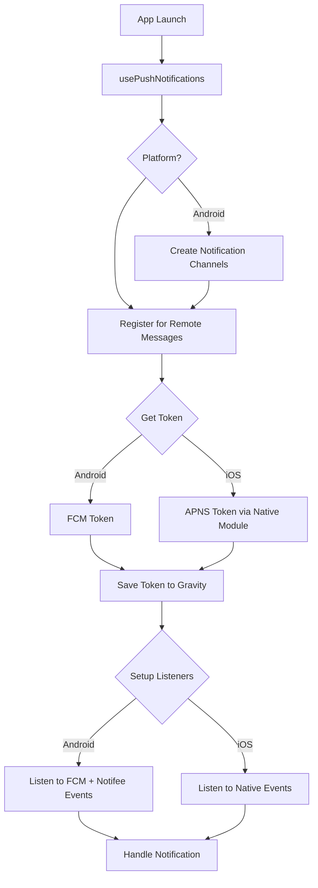
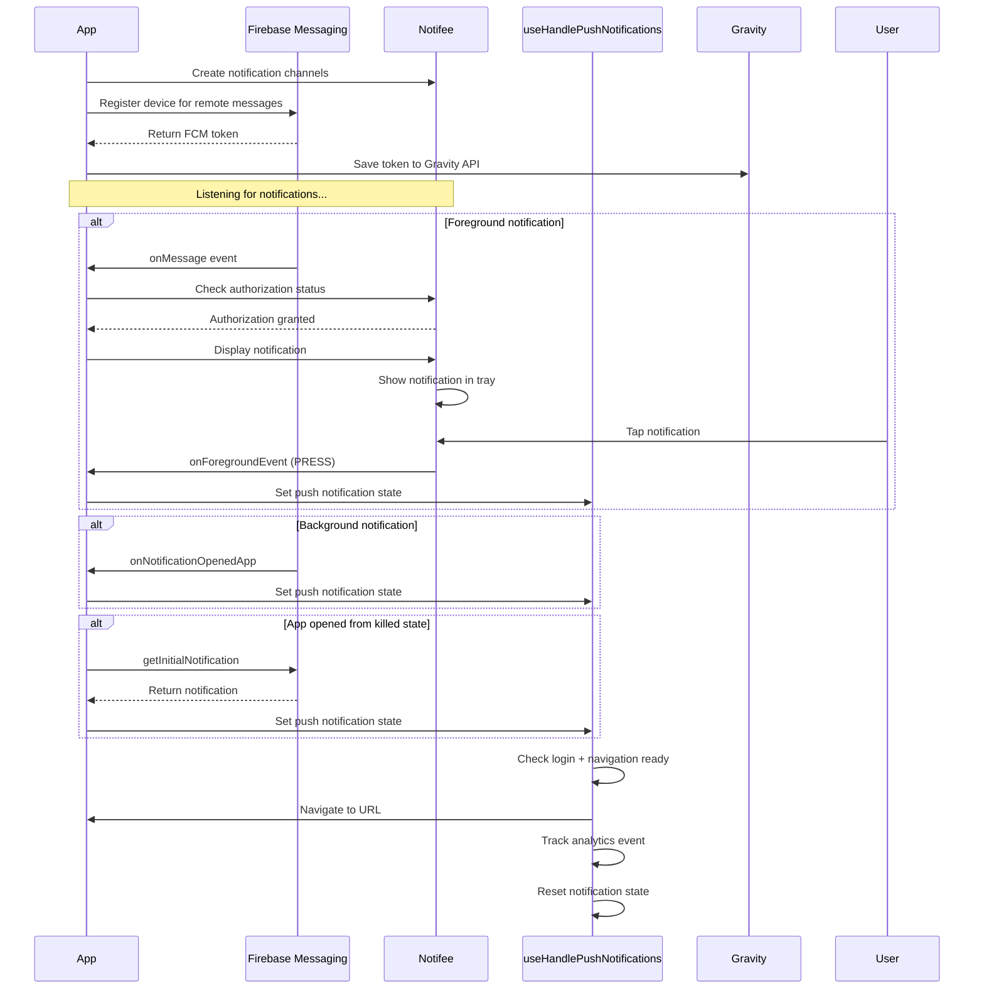
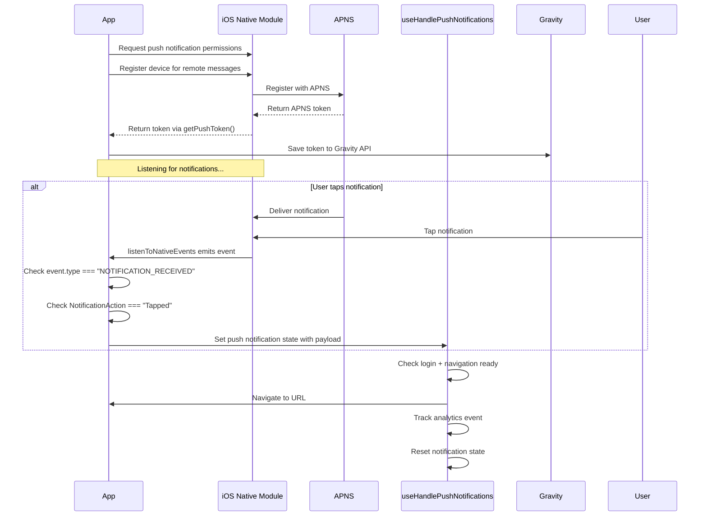

# Push Notifications Architecture

## Overview

The app uses a cross-platform push notification system with platform-specific implementations for Android (FCM + Notifee) and iOS (APNS + Native modules).

## Architecture Components

### Core Hook: [usePushNotifications](../src/app/system/notifications/usePushNotifications.ts)

Main entry point that orchestrates all platform-specific hooks:

- Manages notification state
- Delegates to platform-specific listeners
- Triggers notification handling logic

## Architecture Diagrams

### Combined Flow (High-Level)

### Android Flow (Detailed)

### iOS Flow (Detailed)

## Key Files

- [usePushNotifications.ts](../src/app/system/notifications/usePushNotifications.ts) - Main orchestrator
- [useAndroidListenToPushNotifications.ts](../src/app/system/notifications/useAndroidListenToPushNotifications.ts) - Android listener
- [useIOSListenToPushNotifications.ts](../src/app/system/notifications/useIOSListenToPushNotifications.ts) - iOS listener
- [useHandlePushNotifications.ts](../src/app/system/notifications/useHandlePushNotifications.ts) - Navigation handler
- [useRegisterForRemoteMessages.ts](../src/app/system/notifications/useRegisterForRemoteMessages.ts) - Token registration
- [PushNotification.ts](../src/app/utils/PushNotification.ts) - Gravity token persistence

---

# Sending push notifications to dev or store builds

See our [Push Testing Docs](./push_notifications_testing.md).

<!--
TODO: Add further docs on sending a push notification to your beta/development build
-->
