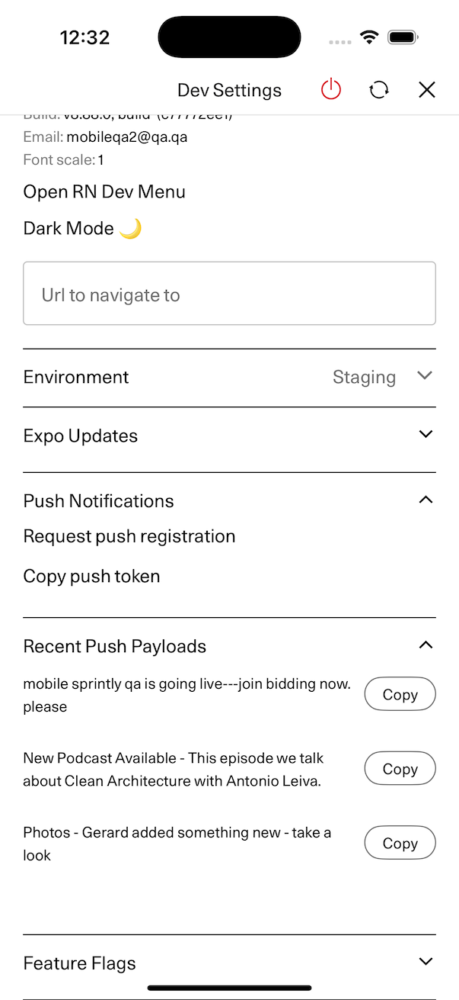

# Testing Push Notifications in Eigen

## Types of Push Notifications

Our push notifications can mostly be divided into 2 categories:

**Internal or transactional push notifications**: These are push notifications that happen in response to some event in our systems. Things like: an auction opening a user is registered for, a work is published matching a saved alert for a user, a user's order gets shipped. These are sent through [pulse](https://github.com/artsy/pulse).
**Marketing and recommendations push notifications**: These are push notifications sent by marketing and editorial either as one offs or on a scheduled basis. They can be things like recommended artworks based on user preferences, an announcement of a big artworld event coverage like vanguard or curated editorial content. These are sent through [Braze](https://www.braze.com).

## iOS Push Testing

### Sandbox vs Production Environments

There are 2 different environments pushes can be sent on and tokens can be registered to. It is important
to understand the difference when debugging push notifications.

**Production**: environment used to send pushes to Testflight and AppStore builds.
**Sandbox**: environment used to send pushes to dev builds on physical devices.

### Obtaining a push token

For most push testing you will need a push token for your device.
To avoid issues with stale tokens from the wrong environment we recommend deleting and reinstalling the application
for the environment you are testing in.

For **production** that is Testflight.
For **sandbox** that is a build onto your physical device from Xcode.

Install the application, sign in, you should see a pair of dialogs asking you to grant push permissions.
Grant access and a new push token will be registered with our backend. You can copy it to your clipboard from the
[Dev Menu](./dev_menu.md), see also [Dev Menu Push Tools](#dev-menu-push-tools).

### Testing Internal Push Notifications

This is covered in the documentation in [Pulse 🔐](https://github.com/artsy/pulse/blob/main/doc/push_notifications.md).
Note that this only works in the **production** environment. Meaning you cannot send to a dev build this way.
See the instructions in [Testing Push Notifications using PushNotifications
app](#testing-push-notifications-using-pushnotifications-app-recommended-method) for a workaround.

### Testing Braze Push Notifications

We have test campaigns set up for this purpose.
They will only send notifications to the mobileqa2 user.
Find credentials in 1pass, follow instructions above for [Obtaining a push token](#obtaining-a-push-token) again for this user.
You will also need a braze api key, also found in 1pass under **Braze Push Notifications API Key**.

`./scripts/utils/send_braze_push_ios.sh <API_KEY>`
`./scripts/utils/send_braze_push_android.sh <API_KEY>`

Note that this only works in the **production** environment. Meaning you cannot send to a dev build this way.
See the instructions in [Testing Push Notifications using PushNotifications
app](#testing-push-notifications-using-pushnotifications-app-recommended-method) for a workaround.

### Testing Push Notifications using PushNotifications app (Recommended Method)

There is an open source app that allows sending to both production and sandbox environments with any push payload you
want. There are instructions for configuration and an example push payload in 1pass under: **Eigen iOS Push Notifications Testing**
https://github.com/onmyway133/PushNotifications

#### Getting additional push payloads + Debugging push payloads

There is a dev menu tool that will display and allow copying recent push payloads in Dev and Testflight builds.
This is useful for a couple scenarios:

1. You are debugging an issue you think related to a specific push payload
2. You want to debug a system that defaults to using the **production** push environment.

For 2, remember you can't send from the **production** push environment to a dev build, so you can't use all your nice debugging tools or change the running code, but we would like to do that when debugging :). One option is to update the system to point to the **sandbox** environment, this is system dependent and may affect other users. An easier option is to capture a payload in question from the real system and then use that payload to replay using the PushNotifications app to the sandbox environment. For all intents and purposes this is exactly the same as sending from the system in question.

##### Steps

1. Trigger the push you are interested in debugging to your self in testflight using the instructions in [Testing Braze Push Notifications](#testing-braze-push-notifications) or [Testing Internal Push Notifications](#testing-internal-push-notifications)
2. Copy the push payload using the tool in the dev menu
3. Paste that payload into the PushNotifications app
4. Update the PushNotifications app to point to sandbox environment
5. Build eigen on your physical iOS device
6. Send your push and debug

### Testing Push Notifications in Simulator

If you only need to test push lifecycle or display for a push payload you can send a dummy push to a simulator.
You can see an example payload in 1pass under **Eigen iOS Push Notifications Testing** other-test-push.apns.

`./scripts/utils/send_sim_push_ios.sh <LOCAL_PATH>/other-test-push.apns`

### Dev Menu Push Tools

- Request Push Registration - trigger a request for push permissions if not granted, if granted display permission status.
- Copy Push Token - copy most recently saved push token to clipboard
- Recent Push Payloads - display title of recently received push payloads and allowing copying full payload to clipboard, only works in Dev and Testflight builds
