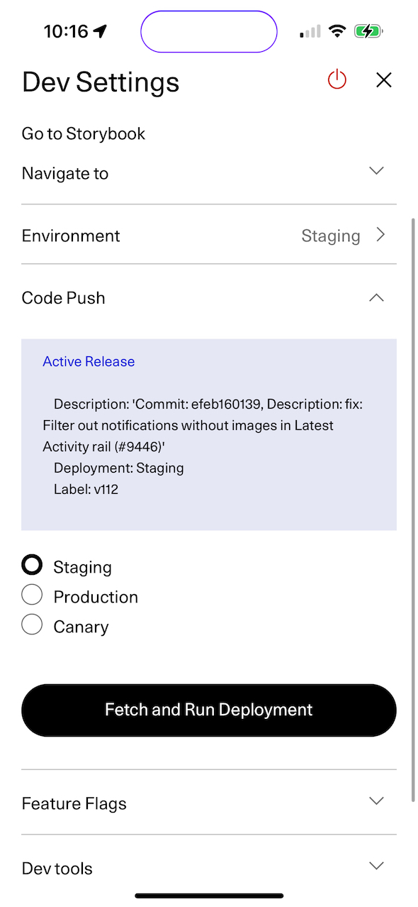

### What is CodePush?

CodePush is a technology from Microsoft that allows us to update the application quickly by deploying js bundles to a server.
You can read more about it in [the microsoft docs.](https://learn.microsoft.com/en-us/appcenter/distribution/codepush/)

### What do we use codepush for?

2 main purposes:

- Enabling stakeholders + devs to test quickly by having the latest code in the repo available in betas
- Deploying hot fixes quickly in the event of a serious bug

### Using CodePush

### In betas

In the dev menu there is a codepush section, select the staging option and tap Fetch and Download. Once downloaded the app will restart with the latest code.

<p align="center">
  
</p>

### Canary builds

If you want to test in progress code in a beta you can deploy a canary build.

> [!IMPORTANT]
> A limitation of codepush is that you can only run the latest build from a deployment, please communicate in #practice-mobile if you are deploying to Canary to avoid overwriting others work.

The first time you do this you will need to install the appcenter-cli:

```
yarn global add appcenter-cli
```

Then run:

```
yarn setup:releases
yarn codepush:deploy 'Canary' 'Some description'
```

### Hotfixes with Codepush

See [deploy_a_hotfix.md](./deploy_a_hotfix.md)

### Gotchas and FAQs

#### Why is my deployment crashing the app when I download in beta?

For codepush to work properly the js bundle needs to be built on the same native foundation as the beta it will run in. So for example if your branch has made changes to the native code either explicitly or by changing a dependency that touches the native code the result may be a crash when attempting to run in beta.

There are a couple things to try:

- make sure you have the latest beta by updating in Testflight or firebase app test
- sync your branch with main and try deploying again

If you continue to have trouble you may need to deploy a regular beta to test.

#### Why do I see `An update is available but it doesn't match your current app version.` when I try to download the latest?

Deployments to codepush must target a specific app version number. So for example if the latest beta is version `8.12.0` but a deployment was made from a branch with version `8.11.0` you will see this message when trying to download. You can try syncing with main to update the version number in your branch and deploying again.

#### Why do we keep getting messaged that `Native code has changed` in #practice-mobile?

Codepush deployments need to have been built on top of the same underlying native code they will run on in order to work properly, otherwise you can get crashes or undefined behavior. This message indicates that something in the native code changed in main so we essentially need to deploy new betas that account for that change to keep using codepush. To do that you can check out the latest main locally and run:

`./scripts/deploys/deploy-beta-both`
