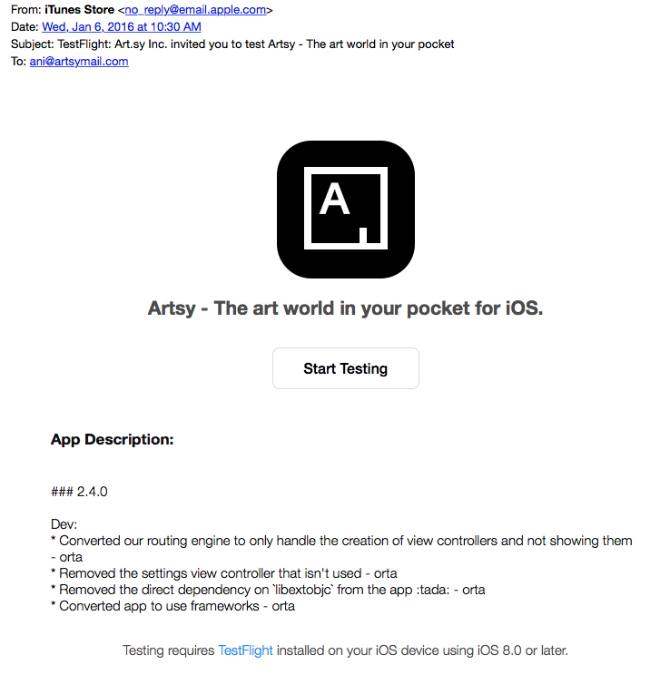

### Welcome to the Eigen Beta

#### Artsy Beta Sign-up

To get started, ask in any Slack channel "where is the eigen beta?" and Slack will respond with a invitation link to TestFlight.

With that done, you should see this:

Which should _eventually_ send an email invite, this will not be instant, and could be a few days away when we make our next beta. Which is when you'll get the email.

  

If you have questions and work in Artsy, ask in the #mobile slack room. If you're just interested as an outsider, tweet [@orta](https://twitter.com/orta/) / [@alloy](https://twitter.com/orta/) / [@artsyopensource](https://twitter.com/orta/) and we'll set you up.

_For Developers:_ You can verify who is on the [Artsy Beta here](https://itunesconnect.apple.com/WebObjects/iTunesConnect.woa/ra/ng/app/703796080/testflight/information).

## What is Testflight.app?

Testflight is like an App store for your beta invites, you are sent an invite in an email and it will connect your iOS device to our betas. To get started click the big "Start Testing" button. It will take you to the App Store to download the app. You can log in with your normal iTunes account. I'd recommend turning on push notifications.

## What happens with Artsy betas?

The Artsy beta will replace your current version of the Artsy app.

## OK, what now?

Well, if you've got it all installed, then you can check out the [Using The Eigen Beta](using_the_beta.md) page.
