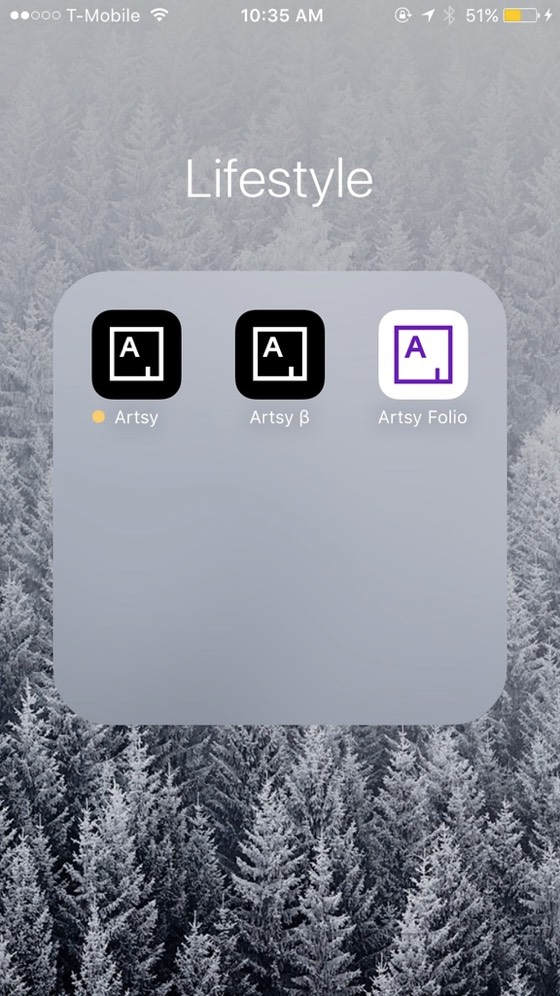

### Welcome to the Eigen Beta

To get started you will have been sent an invite to Apple's Testflight App and a link here. Don't have an email invite yet? If you work in Artsy, ask in the #mobile slack room, if not tweet @orta / @alloy / @artsyopensource and we'll hook you up. This is what iOS developers use to send out pre-release versions of their apps. We have been using a different technique for the last few years, so this works a little differently.

  

## What is Testflight.app? 

Testflight is like an App store for your beta invites, you are sent an invite in an email and it will connect your iOS device to our betas. To get started click the big "Start Testing" button. It will take you to the App Store to download the app. You can log in with your normal iTunes account.  I'd recommend turning on push notifications.

## What happens with Artsy betas?

The Artsy beta will replace your current version of the Artsy app. If you have two copies of the Artsy app, you can remove the one called "Artsy β", it's not going to see any updates from here on in.

  

The main difference you'll see is that now the Artsy app is rocking a beautiful yellow circle. Our release notes are shown on inside Testflight, they tend to be very technical as we make more user facing release notes towards the end of the release cycle for an app. Don't worry if you don't understand them all.

